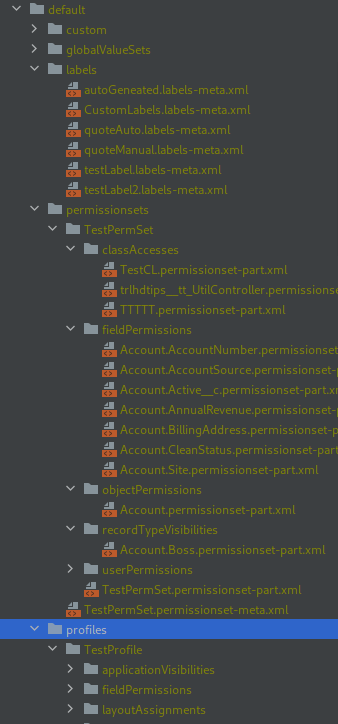
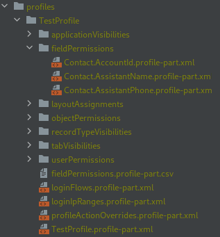

# Split metadata files into separate files

[](https://www.npmjs.com/package/sfdx-metadata-splitter)

Unofficial plugin for splitting metadata files into smaller ones with only one configuration (label, permission to entity and so on) per file.
Example folder with configuration after splitting metadata files can be seen on picture bellow.



## Supported metadata types

- [Custom Labels](https://developer.salesforce.com/docs/atlas.en-us.api_meta.meta/api_meta/meta_customlabels.htm#!)
- [Profiles](https://developer.salesforce.com/docs/atlas.en-us.api_meta.meta/api_meta/meta_profile.htm)
- [Translations](https://developer.salesforce.com/docs/atlas.en-us.api_meta.meta/api_meta/meta_translations.htm)
- [Permission Sets](https://developer.salesforce.com/docs/atlas.en-us.api_meta.meta/api_meta/meta_permissionset.htm)

### Custom Labels

To split labels into separate files, use

```sh
sfdx splitter:labels:split
```

After splitting, each label will be written to separate file, like this:

```xml
<?xml version="1.0" encoding="UTF-8" standalone="yes"?>
<CustomLabels xmlns="http://soap.sforce.com/2006/04/metadata">
    <labels>
        <fullName>autoGeneated</fullName>
        <language>en_US</language>
        <protected>false</protected>
        <shortDescription>Auto Quote</shortDescription>
        <value>This is a auto label.</value>
    </labels>
</CustomLabels>
```

Use split form to store labels in git repository to reduce number of git conflicts on fast developed projects.
You don't need to merge them back before deploying as SFDX is smaart enough to detect them correclty.
If for some reason you would want to merge them back anyway, use

```sh
sfdx splitter:labels:merge
```

### Other types

Translations, profiles and permission sets will be split into files with just one permission or translation.
Generated files will be grouped by xml tag name, for example all apex class accesses for given profile will be placed in "classAccesses" sub folder.



#### Profiles

To split:

```sh
sfdx splitter:profiles:split -r
```

To merge:

```sh
sfdx splitter:profiles:merge -r
```

#### Permission sets

To split:

```sh
sfdx splitter:permission-sets:split -r
```

To merge:

```sh
sfdx splitter:permission-sets:merge -r
```

#### Translations

To split:

```sh
sfdx splitter:translations:split -r
```

To merge:

```sh
sfdx splitter:translations:merge -r
```

## How to use

All commands included in this plugin are in "splitter" topic.
To see all commands available, type

```shell
sfdx splitter --help
```

Every command in this plugin has help page available by adding "--help" flag to command invocation.

### Installation

```shell
sfdx plugins:install sfdx-metadata-splitter
```

or

```shell
echo y | sfdx plugins:install sfdx-metadata-splitter
```

in automation systems to pass signature verification step.
If you are using this plugin in automation systems, I highly recommend locking plugin version:

```shell
echo y | sfdx plugins:install sfdx-metadata-splitter@your.version.number
```

## Other usages

### Sorting "CustomLabels.labels-meta.xml" file

This plugin, although not developed for this use case, can be used to sort custom labels.
To sort labels by full name, execute these commands:

```shell
sfdx splitter:labels:split
sfdx splitter:labels:merge
```

### Solving git conflicts in metadata files

To use this plugin for solving conflicts in metadata files supported by it, we will need to use "git show" command.

1. Create temporary SFDX project with initialized git repository
2. Add conflicted file from branch that you were merging to.
   This can be archived by running command `git show branchName:fullPath`
3. Split this file using this plugin
4. Commit changes
5. Now, remove all split files (but don't commit yet)
6. Add conflicted file from branch that you were merging to original branch
7. Split this file using this plugin
8. Git diff should now show changes between merged branches.
   Verify which versions of files you want.
   After you select all correct versions, merge file back and add it to original repository as version with resolved conflicts

## Considerations

Although splitting files into smaller ones containing only one configuration in them will reduce amount of git conflicts in your project and make them easier to resolve,
this can also have negative consequences.
One of it is that your editor will have to scan larger amount of files when you search for some phrase in your project.
This, depending on device you are working on, can significantly impact IDE performance and search results quality.

From my experience, I would only recommend storing custom labels in split form as ability to search
for them by full name is great.

As for profiles, if you can, you should really stop using them as they are maintenance and security hell.
By switching to permission sets, you can enjoy smaller files (as permissions sets can be defined per Object per User type and grouped into permission set groups)
with smaller chance of git conflict occurring.
Using permsission sets instead of profiles also has this advantage that you can always retrieve permission set and Salesforce will format it for you (this will further reduce git conflict chance).

## Contributing

Contributions, both issues and pull requests, are welcome.
